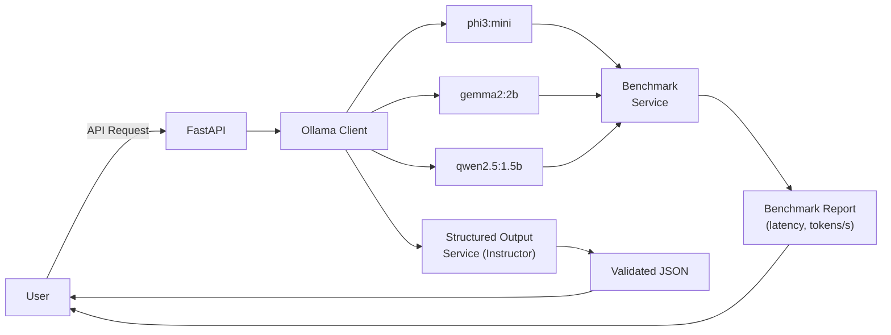

# CloudAura SLM — Local Model Benchmarking

Run, benchmark, and compare small language models entirely offline using Ollama. Measures latency, throughput (tokens/s), and supports structured JSON output extraction.

## Architecture



## Quick Start

```bash
cp .env.example .env
# edit .env with your values
docker compose up -d

# pull benchmark models into Ollama
docker compose exec ollama ollama pull phi3:mini
docker compose exec ollama ollama pull gemma2:2b
docker compose exec ollama ollama pull qwen2.5:1.5b
```

## API Endpoints

| Method | Path | Description |
|--------|------|-------------|
| `GET` | `/health` | Health check — reports Ollama connectivity and available models |
| `GET` | `/api/models` | List all loaded models with size, parameter count, quantization, family |
| `POST` | `/api/chat` | Send chat messages to a specific model; returns content, token count, latency, tokens/s |
| `POST` | `/api/benchmark` | Run a multi-model benchmark across prompts; returns per-model latency and throughput stats |
| `GET` | `/api/benchmark/latest` | Retrieve the most recent benchmark report |
| `POST` | `/api/structured` | Generate structured JSON output validated against a provided schema |
| `GET` | `/metrics` | Prometheus metrics (request latency, counts, etc.) |

## Tech Stack

- **Runtime:** Python 3.12 / FastAPI 0.115 / Uvicorn
- **LLM Backend:** Ollama (local inference, no API keys required)
- **Structured Output:** Instructor 1.7 + OpenAI SDK (Ollama-compatible endpoint)
- **Observability:** structlog (JSON), prometheus-fastapi-instrumentator
- **Testing:** pytest + pytest-asyncio + pytest-httpx

## Configuration

| Variable | Description | Default |
|----------|-------------|---------|
| `APP_HOST` | Bind address | `0.0.0.0` |
| `APP_PORT` | Application port | `8002` |
| `LOG_LEVEL` | Logging level | `info` |
| `OLLAMA_BASE_URL` | Ollama API URL | `http://ollama:11434` |
| `BENCHMARK_MODELS` | Comma-separated list of models to benchmark | `phi3:mini,gemma2:2b,qwen2.5:1.5b` |
| `RESULTS_DIR` | Directory for persisting benchmark results | `/app/benchmark_results` |

## Testing

```bash
pytest tests/ -v
```

## Monitoring

Prometheus metrics exposed at `/metrics`. Scraped by the portfolio-wide Prometheus instance and visualized on the Grafana dashboard at `observe.cloudaura.cloud`.
